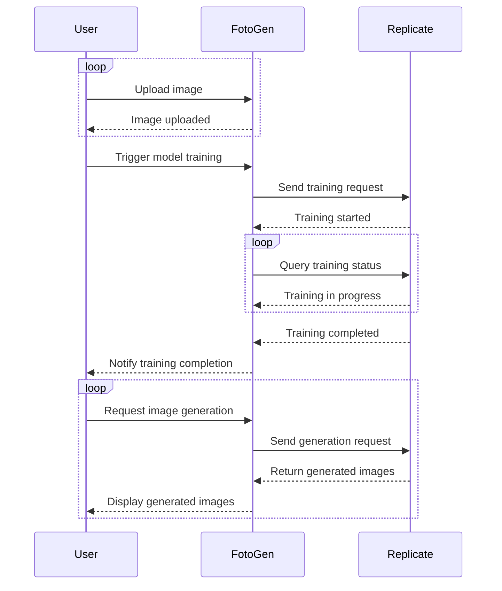

# Application Flow Documentation

This document describes the main user flow for the FotoGen application.

## User Flow Overview

The FotoGen application enables users to:

1. Upload Images
2. Start Image Model Customization (Fine-tuning)
3. Receive Notification Upon Completion of Custom Model Training
4. Generate Images Using the Custom Model

---

## Flow Diagram

---

## Step Details

### 1. Upload Images (Repeatable)
- U (User) uploads one or more images to F (FotoGen).
- F (FotoGen) confirms each image upload to U (User).
- This step can be repeated as many times as needed before starting model training.

### 2. Start Model Training
- U (User) triggers model training in F (FotoGen) after uploading images.
- F (FotoGen) sends a training request to R (Replicate).
- R (Replicate) acknowledges that training has started.
- F (FotoGen) periodically queries R (Replicate) for training status.
- R (Replicate) responds with training progress until training is complete.
- Once training is finished, R (Replicate) notifies F (FotoGen).
- F (FotoGen) notifies U (User) that training is complete.

### 3. Generate Images (Repeatable)
- U (User) requests image generation from F (FotoGen) using the trained custom model.
- F (FotoGen) sends the generation request to R (Replicate).
- R (Replicate) generates images and returns them to F (FotoGen).
- F (FotoGen) displays the generated images to U (User).
- This step can be repeated as many times as desired.
